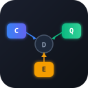

# Cqrs

<p align="center">
  
</p>

[](https://github.com/KatzuoOgust/cqrs/actions/workflows/ci.yml)
[](https://www.nuget.org/packages/KatzuoOgust.Cqrs)
[](https://www.nuget.org/packages/KatzuoOgust.Cqrs.Pipeline.Middlewares)
[](https://www.nuget.org/packages/KatzuoOgust.Cqrs.Pipeline.Behaviours)
[](https://www.nuget.org/packages/KatzuoOgust.Cqrs.DependencyInjection)
[](https://www.nuget.org/packages/KatzuoOgust.Cqrs.Analyzer)

Lightweight, framework-agnostic CQRS abstractions for .NET 10. Zero NuGet dependencies in the core library.

## Installation

```sh
dotnet add package KatzuoOgust.Cqrs

# optional add-ons
dotnet add package KatzuoOgust.Cqrs.Pipeline.Middlewares   # typed per-request middleware
dotnet add package KatzuoOgust.Cqrs.Pipeline.Behaviours    # non-generic cross-cutting behaviours
dotnet add package KatzuoOgust.Cqrs.DependencyInjection    # handler decorator support
dotnet add package KatzuoOgust.Cqrs.Analyzer               # compile-time CQRS rules
```

## Quick start

```csharp
// 1. Define a command and its handler
public record CreateOrderCommand(Guid OrderId) : ICommand;

public class CreateOrderHandler : ICommandHandler<CreateOrderCommand>
{
    public Task HandleAsync(CreateOrderCommand command, CancellationToken ct = default)
    {
        // ...
        return Task.CompletedTask;
    }
}

// 2. Dispatch
IDispatcher dispatcher = new Dispatcher(serviceProvider);
await dispatcher.InvokeAsync(new CreateOrderCommand(Guid.NewGuid()));
```

See [Usage](#usage) for queries, events, middleware, and the full pipeline stack.

## Packages

| Package | Namespace | Description |
|---|---|---|
| `Cqrs` | `KatzuoOgust.Cqrs` | Core interfaces, null-object handlers, `Dispatcher`, `EventDispatcher` |
| `Cqrs.Pipeline.Middlewares` | `KatzuoOgust.Cqrs.Pipeline.Middlewares` | Typed per-request/event middleware with full result access |
| `Cqrs.Pipeline.Behaviours` | `KatzuoOgust.Cqrs.Pipeline.Behaviours` | Non-generic cross-cutting pipeline behaviours |
| `Cqrs.DependencyInjection` | `KatzuoOgust.Cqrs.DependencyInjection` | `IServiceProvider` decorator that layers exact and open-generic handler decorators |
| `Cqrs.Analyzer` | `KatzuoOgust.Cqrs.Analyzer` | Roslyn analyzers that enforce CQRS usage rules at compile time |

## Core abstractions (`Cqrs`)

Mark commands with `ICommand` (void) or `ICommand<TResponse>` (valued), queries with `IQuery<TResponse>`, and events with `IEvent`. Implement the matching handler interface — `ICommandHandler<T>`, `IQueryHandler<T, TResponse>`, or `IEventHandler<T>` — then dispatch via `IDispatcher` or publish via `IEventBus`.

## Middlewares (`Cqrs.Pipeline.Middlewares`)

Implement `IRequestMiddleware<TRequest, TResult>` to wrap a specific request type (has full access to the typed result), or `IEventMiddleware<TEvent>` for events. Register as `IEnumerable<IRequestMiddleware<TRequest, TResult>>` — first registered is outermost. Wrap `Dispatcher` with `MiddlewareAwareDispatcher`.

## Behaviours (`Cqrs.Pipeline.Behaviours`)

Implement `IRequestPipelineBehaviour` to intercept every request regardless of type (`next` returns `Task<object?>`), or `IEventPipelineBehaviour` for events. Register as `IEnumerable<IRequestPipelineBehaviour>` — first registered is outermost. Wrap with `BehaviourAwareDispatcher`.

## Handler decorators (`Cqrs.DependencyInjection`)

`DecoratingServiceProvider` wraps any `IServiceProvider` and layers handler decorators at resolve time via `DecoratingServiceProviderExtensions`:

| Method | Description |
|---|---|
| `.Decorate<TService>(Func<TService, IServiceProvider, TService>)` | Exact-type lambda decorator |
| `.Decorate<TDecorator>()` | Exact-type decorator; service type inferred from constructor |
| `.Decorate<TService, TDecorator>()` | Exact-type decorator; service type explicit |
| `.Decorate(openServiceType, Func<Type, object, IServiceProvider, object>)` | Open-generic lambda decorator |
| `.Decorate(openServiceType, openDecoratorType)` | Open-generic type decorator; constructor resolved via Expression trees |
| `.When(predicate, configure)` | Applies inner decorators only when predicate returns `true` |

Decorators are applied in **registration order** — first registered wraps the raw service, last registered is outermost.

## Usage

```csharp
// Building on the Quick start — add a query and an event:
public record GetOrderQuery(Guid OrderId) : IQuery<OrderDto>;

public record OrderShipped(Guid OrderId) : IEvent;

// Dispatch a command and a query
IDispatcher dispatcher = new Dispatcher(serviceProvider);
await dispatcher.InvokeAsync(new CreateOrderCommand(Guid.NewGuid()));
var order = await dispatcher.InvokeAsync(new GetOrderQuery(id));

// Publish an event (fans out to all registered IEventHandler<OrderShipped>)
IEventBus bus = new EventDispatcher(serviceProvider);
await bus.PublishAsync(new OrderShipped(id));
```

### Adding handler decorators

```csharp
var sp = new DecoratingServiceProvider(innerProvider);

// Exact: wraps only ICommandHandler<CreateOrderCommand>
sp.Decorate<ICommandHandler<CreateOrderCommand>>(
    (inner, _) => new ValidationDecorator(inner));

// Open-generic: wraps every ICommandHandler<T> — one registration covers all command types
sp.Decorate(typeof(ICommandHandler<>), typeof(LoggingCommandDecorator<>));

// Call chain (outermost first):
//   LoggingCommandDecorator   ← registered 2nd → outermost
//   └─ ValidationDecorator    ← registered 1st
//      └─ raw handler

IDispatcher dispatcher = new Dispatcher(sp);
```

### Adding middleware

```csharp
// Typed — bound to one (TRequest, TResult) pair, sees the concrete result
public class ValidationMiddleware : IRequestMiddleware<CreateOrderCommand, Unit>
{
    public async Task<Unit> HandleAsync(CreateOrderCommand req, CancellationToken ct,
        RequestMiddlewareDelegate<Unit> next)
    {
        // validate...
        return await next(ct);
    }
}

// Register as IEnumerable<IRequestMiddleware<CreateOrderCommand, Unit>> in your container
IDispatcher dispatcher = new MiddlewareAwareDispatcher(new Dispatcher(sp), sp);
```

### Adding pipeline behaviours

```csharp
// Non-generic — applies to every request
public class LoggingBehaviour : IRequestPipelineBehaviour
{
    public async Task<object?> HandleAsync(IRequest request, CancellationToken ct,
        RequestBehaviourDelegate next)
    {
        Console.WriteLine($"→ {request.GetType().Name}");
        var result = await next(ct);
        Console.WriteLine($"← {request.GetType().Name}");
        return result;
    }
}

// Register as IEnumerable<IRequestPipelineBehaviour> in your container
IDispatcher dispatcher = new BehaviourAwareDispatcher(new Dispatcher(sp), sp);
```

### Combining all layers

```csharp
// Outermost → innermost:
//   BehaviourAwareDispatcher  — non-generic, cross-cutting concerns
//   └─ MiddlewareAwareDispatcher — typed, per-request concerns
//      └─ Dispatcher          — routes to handler
IDispatcher dispatcher =
    new BehaviourAwareDispatcher(
        new MiddlewareAwareDispatcher(
            new Dispatcher(sp),
            sp),
        sp);
```

## Analyzer (`Cqrs.Analyzer`)

Roslyn analyzers shipped as a separate package that enforce CQRS usage rules at compile time.

| ID | Severity | Rule |
|---|---|---|
| `CQRS001` | Error | Don't implement `IRequest<T>` directly — use `ICommand<T>` or `IQuery<T>` |
| `CQRS002` | Warning | `IQuery<Unit>` is meaningless — use `ICommand` instead |
| `CQRS003` | Warning | `ICommandHandler<T, Unit>` should be `ICommandHandler<T>` |
| `CQRS020` | Warning | `IRequestMiddleware` implementation must call `next()` — omitting it silently breaks the pipeline |
| `CQRS021` | Warning | Don't cast the non-generic `request` parameter inside `IRequestPipelineBehaviour` — use `IRequestMiddleware<TRequest, TResult>` for type-specific logic |
| `CQRS030` | Info | Handler whose body is only `return Task.CompletedTask` should use `NullCommandHandler<T>.Instance` |
| `CQRS031` | Info | Handler returning `default!` suggests a forgotten implementation |

## Examples

Runnable examples covering all three layers live in [`examples/Cqrs.Examples`](examples/Cqrs.Examples):

| File | What it shows |
|---|---|
| `Decorators/DecoratorsExample.cs` | Exact + open-generic handler decorators via `DecoratingServiceProvider` |
| `Middlewares/MiddlewaresExample.cs` | Typed `IRequestMiddleware` chain via `MiddlewareAwareDispatcher` |
| `Behaviours/BehavioursExample.cs` | `IRequestPipelineBehaviour` + full combined pipeline stack |

```sh
dotnet run --project examples/Cqrs.Examples
```

## Build

```sh
make build   # dotnet build Cqrs.slnx
make test    # dotnet test Cqrs.slnx
```

Requires [.NET 10 SDK](https://dotnet.microsoft.com/download). See [CONTRIBUTING.md](CONTRIBUTING.md) for the full build/test/pack/clean workflow.

## Contributing

See [CONTRIBUTING.md](CONTRIBUTING.md).
